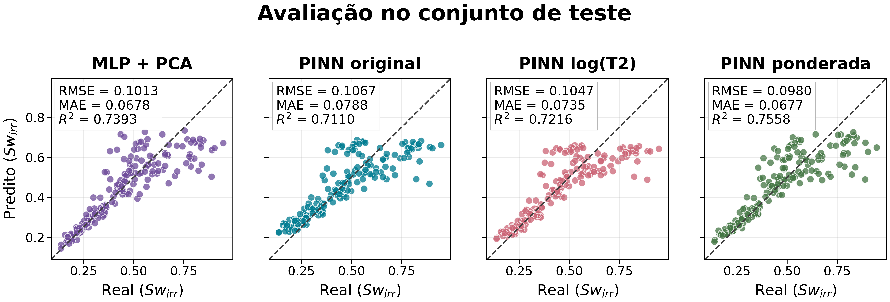
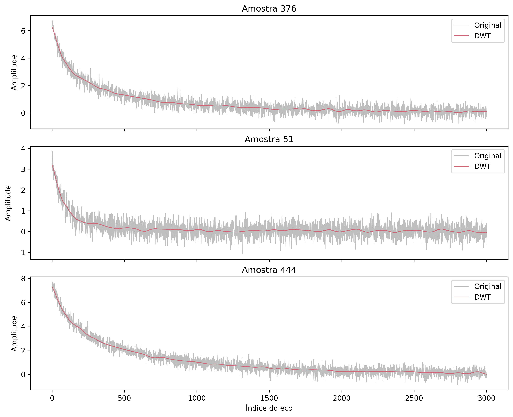
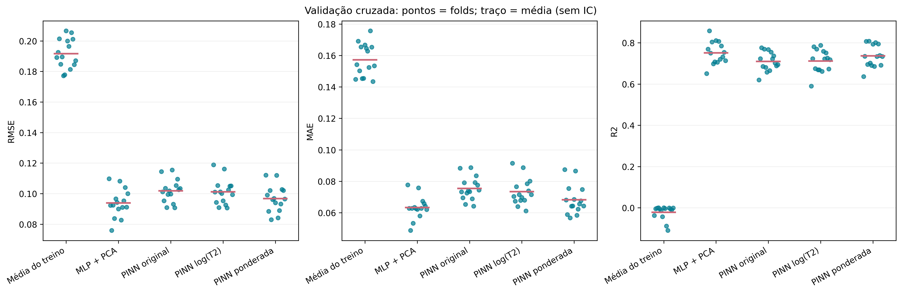

# Water Saturation from NMR Signals with Physics-Informed Neural Networks

This repository contains the experimental code for **Water Saturation in Porous Media from Nuclear Magnetic Resonance Data Using Physics-Informed Neural Networks**. It predicts irreducible water saturation (`Swirr_PHIX`) directly from Nuclear Magnetic Resonance (NMR) magnetization-decay curves, without requiring a separate inverse $T_2$-distribution workflow.

The project compares a PCA-based multilayer perceptron (MLP) with three physics-informed neural network (PINN) formulations. The accompanying manuscript is available in [paper.tex](paper.tex).



## What the experiment does

The input is a synthetic Gulf of Mexico gas-hydrate NMR dataset derived from well-log and petrophysical information. Each record represents a distinct NMR sample from the same well and contains:

| Item | Description |
| --- | --- |
| Raw input | 3,000 echo amplitudes describing an NMR transverse-magnetization decay |
| Target | Irreducible water saturation, `Swirr_PHIX` |
| Auxiliary properties | `MBVI`, `MPHI`, and `PHIX` |
| Original samples | 575 |
| Processed input | 500 echo bins per sample |

The preprocessing stage denoises each curve with a Daubechies-6 discrete wavelet transform, applies per-curve min--max normalization, removes the last 1,000 echoes, and averages consecutive echoes in groups of four. This reduces each signal from 3,000 to 500 values.



The training partition is enlarged with physically motivated MixUp. Two original NMR curves are linearly combined, while `MBVI`, `MPHI`, and `PHIX` are interpolated consistently. The synthetic saturation is then recomputed as:

\[
S_{wirr,\mathrm{syn}} = \frac{MBVI_{\mathrm{syn}}}{PHIX_{\mathrm{syn}}}.
\]

## Models

| Model | Input | Main idea |
| --- | --- | --- |
| **MLP + PCA** | PCA components retaining 99.9% variance | Data-driven regression baseline with two hidden layers |
| **Base PINN** | 500 processed echo values | Predicts amplitudes and relaxation times, reconstructing a bi-exponential decay |
| **PINN log($T_2$)** | 500 processed echo values | Uses a log-space parameterization for positive relaxation times |
| **Direct-saturation PINN** | 500 processed echo values | Predicts `Swirr` directly while retaining a constrained bi-exponential reconstruction loss |

The three PINNs share a 500 → 128 → 32 → 4 fully connected backbone. The direct-saturation variant gives more emphasis to saturation accuracy while still penalizing physically implausible signal reconstructions.

## Evaluation protocol

The evaluation is designed to estimate performance on **new NMR samples from the same well**. It does not establish generalization to a different well.

- 175 original samples are held out for the final test.
- The remaining 400 samples are used for repeated five-fold cross-validation with three repetitions.
- Each outer fold uses an internal 20% validation holdout for checkpoint selection and learning-rate scheduling.
- PCA and MixUp are fitted or generated only from the training samples of the relevant split.
- RMSE, MAE, and $R^2$ are computed from out-of-fold predictions.
- The final test reports 95% percentile confidence intervals from 2,000 paired bootstrap resamples.

The MLP was selected by mean out-of-fold RMSE in the repeated cross-validation. On the final test split, the direct-saturation PINN had the best point estimates. The confidence intervals and pairwise bootstrap comparisons are saved with every pipeline run.

| Model | Test RMSE | Test MAE | Test $R^2$ |
| --- | ---: | ---: | ---: |
| MLP + PCA | 0.1013 | 0.0678 | 0.7393 |
| Base PINN | 0.1067 | 0.0788 | 0.7110 |
| PINN log($T_2$) | 0.1047 | 0.0735 | 0.7216 |
| Direct-saturation PINN | **0.0980** | **0.0677** | **0.7558** |



## Quick start

The project requires Python 3.10 or later. From the repository root on Windows PowerShell:

```powershell
python -m venv .venv
.venv/Scripts/python -m pip install -r requirements.txt
.venv/Scripts/python main.py
```

The default run reads `RMN_data/GulfCoast_RMN_Synthetic.csv` and writes artifacts to `output/pipeline/`.

For a short integration run:

```powershell
.venv/Scripts/python main.py --mlp-epochs 2 --pinn-epochs 2 --output-dir output/smoke_test
```

To skip preprocessing and reuse the processed 500-echo dataset:

```powershell
.venv/Scripts/python main.py --input model_input.csv --preprocessed
```

Run `main.py --help` for all options, including cross-validation folds, repetitions, bootstrap resamples, training epochs, device selection, and output location.

## Outputs

Each full execution produces the following under `output/pipeline/` by default:

| Path | Contents |
| --- | --- |
| `model_input.csv` | Processed signals and petrophysical properties |
| `splits.csv` | Original-sample train, validation, and test assignments |
| `train_augmented.csv` | Training data after MixUp augmentation |
| `metrics.csv` and `predictions_test.csv` | Test metrics and aligned predictions |
| `cross_validation/` | Fold assignments, out-of-fold predictions, histories, and model selection |
| `test_confidence_intervals.csv` | 95% bootstrap confidence intervals |
| `test_paired_comparisons.csv` | Paired bootstrap differences between models |
| `evaluation_report.md` | Plain-language evaluation report and caveats |
| `checkpoints/` | PyTorch model weights and the fitted PCA object |
| `figures/` | Publication-oriented PNG and PDF figures |

## Repository layout

```text
main.py                 End-to-end pipeline entry point
preprocess/             Data validation, denoising, compression, splitting, and PCA
models/                 Augmentation, MLPs, PINNs, training, CV, and evaluation
func_plots/             Reusable article-quality plotting functions
assets/                 Figures displayed in this README
RMN_data/               Synthetic NMR dataset used by the experiment
output/                 Generated artifacts; ignored by Git
tests/                  Unit and numerical validation tests
paper.tex               Manuscript source
```

## Tests

```powershell
.venv/Scripts/python -m unittest discover -s tests -v
```

The test suite checks signal preprocessing, the physical MixUp relationship, leakage-safe partitioning, PCA fitting, PINN losses, cross-validation coverage, bootstrap intervals, and finite gradients.

## Authors

- **Arick Jurdan dos Reis** — Instituto Tércio Pacitti de Aplicações e Pesquisas Computacionais, Federal University of Rio de Janeiro (UFRJ)
- **Lorena Mamede Botelho** — Instituto Tércio Pacitti de Aplicações e Pesquisas Computacionais, Federal University of Rio de Janeiro (UFRJ)
- **Claudio Miceli de Farias** — Instituto Tércio Pacitti de Aplicações e Pesquisas Computacionais, Federal University of Rio de Janeiro (UFRJ)
- **Marcio Mendes Taddei** — Brazilian Center for Research in Physics (CBPF)

For experimental context, model details, and the dataset reference, see [paper.tex](paper.tex).
