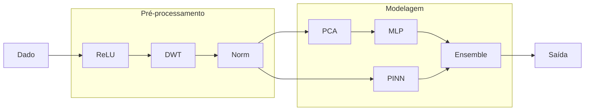

title: Improving direct prediction of water saturation from raw NMR signals using deep learning and physical informed approaches

resume:

# Related works:

## DeepSWIrr: Determining irreducible water saturation from raw Nuclear Magnetic Resonance decays using deep learning

Abstract Summary
Estimating the Irreducible Water Saturation (Swirr) of a reservoir is an important but challenging task,
typically accomplished using Nuclear Magnetic Resonance (NMR) data. Laboratory data is used to
complement logging data to improve accuracy; however, the technique used for upscaling is a matter
of choice, potentially leading to different results using the same data. Here, we try to circumvent
this problem by estimating SWIrr directly from the echo trains using deep learning (DL), without any
modeling. We obtained raw laboratory NMR data from carbonate reservoirs and used it to train a
multi-scale convolutional network. Due to the scarcity of labeled laboratory data, we employed a data
augmentation scheme that combines two or more samples.
After optimizing the hyperparameters of the network, our best model has a coefficient of corre
lation of 90% on a blind test set. This serves as validation of the methodology before applying it to
noisier logging data.
Introduction
The amount of Irreducible Water Saturation (Swirr) is closely related to the amount of oil that can
be extracted from a reservoir. It is, therefore, one of the important quantities to determine during
reservoir characterization. However, determining Swirrmost of the time involves knowing the T2
distribution, and determining a cutoff value, from where Swirrcan then be inferred. Determining the
T2 distribution is a complex matter, where an inverse Laplace transformation is needed, and different
noise models can give rise to different T2 distributions even when the signal-to-noise ratio (SNR)
is the same. Even so, finding a cutoff value in the T2 distribution is still problematic, and different
methods have been proposed (e.g. Liu et al., 2022; Solatpour et al., 2018). Efforts have been made
to mitigate these shortcomings (ref), but still the determination of the T2 distribution from magnetic
decays is an ill-posed problem with no obvious solution.
Here, we try to eliminate this problem by using a DL model to estimate Swirrfrom NMR data
directly, without intermediary steps or complex modeling. Deep Learning (DL) is a natural approach
for this task, and has been used extensively for several applications with borehole data: lithology
classification (Valent´ın et al., 2019), porosity and permeability determination (Bom et al., 2021),
determination of subsurfaces (Kurup and Griffin, 2006), among others.
To avoid the need for modeling or calculation the T2 distribution, we use laboratory samples from
carbonate reservoirs, where Swirrwas measured directly, without resorting to modeling or setting
cutoff values.

Method
We built a dataset composed of 873 laboratory NMR samples (decharacterized) from carbonate
reservoirs in the pre-salt region of Brazil, containing the echo trains and basic petrophysical prop
erties such as Swirr, porosity, and permeability. The sample was cleaned and preprocessed by the
following steps:
• Cut all samples where at least one of the echo trains had less than 1000 points;
• Perform a rotation so that all noise is concentrated in one channel, while the other has just the
signal;
• Cut both channels to 1000 decays.
After all these cuts, we are left with 821 samples. Besides the properties, measurements were done
when the plug was saturated with water or with water and an oil-based mud filtrate; henceforth, we
will call these states SW and SWI, respectively. Although the echo trains for a given plug are slightly
different in the two states, Swirris the same. Initial testing showed that this was a source of confusion
for the neural network. We therefore further split our dataset into SW (372 plugs) and SWI (449
plugs) states. Finally, we chose 50 plugs that are common to both states to serve as a blind test
sample; our training SW sample contains 322 plugs, while the SWI sample contains 399.
Since DL models are notoriously data-hungry and we only have less than five hundred samples
per state, we employed a data augmentation scheme where pairs (or even triplets) of plugs can be
combined to create a synthetic one, with new decays and Swirr:

(1)
\begin{equation}
m(w) = w \times m_1 + (1-w)\times m_2
\end{equation}

\begin{equation}
SV(w) =
\frac{
w \cdot SW_1 \cdot VB_1 \cdot \phi_1

- (1-w)\cdot SW_2 \cdot VB_2 \cdot \phi_2
  }{
  w \cdot VB_1 \cdot \phi_1
- (1-w)\cdot VB_2 \cdot \phi_2
  }
  \end{equation}
  .
  (2)
  \begin{align}
  m(w) &= w\,m_1 + (1-w)\,m_2 \\
  SV(w) &=
  \frac{
  w\,SW_1\,VB_1\,\phi_1 +
  (1-w)\,SW_2\,VB_2\,\phi_2
  }{
  w\,VB_1\,\phi_1 +
  (1-w)\,VB_2\,\phi_2
  }
  \end{align}

Where m are the magnetic decays, SW is the Swirr, w is a weight, VB is the bulk volume and ϕ is
the porosity. Our dataset, however, lacks information about the bulk volume. We therefore normalize
the decays to the range [0,1]; in this way, we can assume that VB · ϕ = 1.
Our architecture is a multi-scale convolutional network, depicted in Figure 1. By choosing different
kernel sizes for each convolutional block, we aim to capture the different structures of the echo
train. Each state (SW and SWI) will have a different model, trained specifically for that state. We
furthermore optimize the hyperparameters for each model using 50 plugs from the training set as a
validation: the best set of hyperparameters is the one that achieves the lowest validation loss. After
optimization, we retrain the network using a 5-fold cross-validation, wherein the augmented training
data is split into five different groups, and five iterations of training are performed. At each iteration,
one of the groups is used for validation, while the rest is used for training. In the end, the model with
the lowest validation loss at each iteration is chosen as the best.
Results
Here we report the results for the test set, comprising 50 plugs common to both SW and SWi states.
In Figure 2, a scatter plot of the true vs. the predicted values is shown, for both states. It can be seen
that the results are satisfactory, with a coefficient of correlation approximately 0.9 for both states.
The bulkiness of a sample is a measure of how much bulk processes influence the relaxation
time:

\begin{align}
\beta(T) &= 1 - \left(1 - \frac{T}{T_B}\right)^2
\end{align}

We calculate it by fitting a second-order polynomial to the first 40 points of the echo train, imposing the
condition that the independent term is equal to the porosity. Plugs with high bulkiness are less likely
to be affected by the magnetization, since the pores are larger, and therefore the connection between
magnetic decays and Swirris less evident. Looking at Figure 3, we can see that for the results are
better for the low bulkiness (defined as β ≤ 0.5)sample, when compared to high bulkiness.
Conclusions
This work showed a first effort to obtain Swirr directly from magnetic decays using laboratory plugs
using neural networks. The model was able to perform satisfactorily, recovering Swirr from a blind
test sample with good accuracy for both states. As expected, results for low bulkiness are better than
for high bulkiness. More work needs to be done to apply this methodology to logging data, which is
significantly noisier

## Direct Prediction of Oil Saturation from NMR T₂ Spectra Using Unsupervised Feature Decoupling and Deep Learning

Nuclear magnetic resonance (NMR) T2 spectra provide pore-scale information on fluid occurrence and mobility and are widely used for saturation evaluation. However, in shale and other unconventional reservoirs, strong heterogeneity, multi-fluid signal overlap, and weak/complex relaxation responses often undermine the reliability of conventional cutoff- and template-based saturation methods.

To address this challenge, we propose a data-driven workflow that directly predicts oil saturation from NMR T2 spectra by integrating feature engineering, unsupervised decoupling, and a compact deep-learning regressor. The method first applies robust preprocessing to suppress abnormal values and outliers, followed by dimensionality reduction to extract the most informative latent features. To alleviate multi-component signal superposition, an unsupervised clustering step is introduced to partition spectral patterns into representative groups, providing a more stable feature basis for learning. Finally, a lightweight convolutional neural network (CNN) is employed as the regression model to map processed T2 features to core-calibrated oil saturation, with standard strategies (normalization, dropout/regularization, and learning-rate scheduling) to improve generalization.

The workflow is validated using core-log paired datasets from a shale reservoir, showing that the predicted oil saturation agrees well with laboratory measurements and significantly improves stability compared with conventional interpretation in complex intervals. The proposed approach offers an efficient and scalable route for saturation evaluation in data-limited unconventional plays, supporting sweet-spot identification and development planning.

This research was supported by the National Oil & Gas Major Project (No. 2025ZD1400202) and Natural Science Foundation of Shandong Province, China (No. ZR2023YQ034).

How to cite: Li, Q., Wang, C., Ge, X., Chi, R., Wang, Y., Zhang, W., Miao, Q., and Zhang, J.: Direct Prediction of Oil Saturation from NMR T₂ Spectra Using Unsupervised Feature Decoupling and Deep Learning, EGU General Assembly 2026, Vienna, Austria, 3–8 May 2026, EGU26-3276, https://doi.org/10.5194/egusphere-egu26-3276, 2026.

# Introduction

## fundamentação teorica

## dados

dados sinteticos gerados de acordo com o travalho de [arick] e Premissas do algoritmo

1. O tamanho dos poros segue uma distribuição Log Normal
2. As amostras correspondem apenas a 1

### **Estratégia de Preparação dos Modelo**

**Para ML temos duas abordagens de entrada principais**:

1. **Abordagem de Curva Bruta (MEUS MODELO):** Suas _features_ (X) são os pontos temporais do decaimento da magnetização M(t) (ex: 2048 ecos de uma sequência CPMG). O alvo (Y) é o percentual de saturação de água (S*{w}) ou óleo (S*{o}).
   Modelos:
2. **Abordagem de Espectro Invertido (A MAIORIA DOS ARTIGOS):** Primeiro, aplica-se a inversão matemática clássica (como a regularização de Tikhonov) para transformar M(t) na distribuição de tempos de relaxação T*{2}. Suas *features* passam a ser as amplitudes das componentes de T*{2}(normalmente 64 ou 128 bins de tempo).

## Metodos de préprocessamento:

Extração de features: TSFresh (Citar a propria lib)

- Statistical Rigor: The library applies statistical hypothesis tests to determine feature relevance, ensuring the selected features are statistically significant and less prone to overfitting.
- Scalability: it is designed to handle large datasets efficiently (multiple time series: RMN)
- Usamos 3 funções, em 2 tamanhos diferentes (700 e 2000):
  - MinimalFCParameters() → fast, stable
  - EfficientFCParameters() → richer
  - ComprehensiveFCParameters() → huge and slow

Wavelet (alguem falou que era bom, citar outros trabalhos que usaram)

- DWT para smoothing
- explicar pq era melhor q savtski golay (tradicional)

## Otimização

implementação do código: Optuna Optuna - A hyperparameter optimization framework

metodo: usamos o default: TPE (Tree-Structured Parzen Estimator)

## Modelos

- **LightGBM**: LightGBM: A Highly Efficient Gradient Boosting Decision Tree
- Catboost: CatBoost | Proceedings of the 32nd International Conference on Neural Information Processing Systems
- LogisticRegression
- **Random Forest:** skit-learn
- CNN: pytorch
- RNN: pytorch
  - GRU Gated Recurrent Neural Networks on Sequence Modeling
  - BiLSTM Sequence-to-One Regression Using Deep Learning - MATLAB & Simulink
- **Temporal Convolutional Network**: pytorch
- **Temporal Fusion Transformer:** Temporal Fusion Transformers for interpretable multi-horizon time series forecasting (adaptei a arquitetura de seq-to-seq para seq-to-scalar )
- Vanilla Transformer (Encoder only)
- **Regressão Simbolica**: PySRRegressor do skitlearn
- MLP
- MLP Physical informed (our approach)

## Metricas

MAE e RMSE

pipeline

# Acknowledgement

CBPF
Petrobras
Labnet
